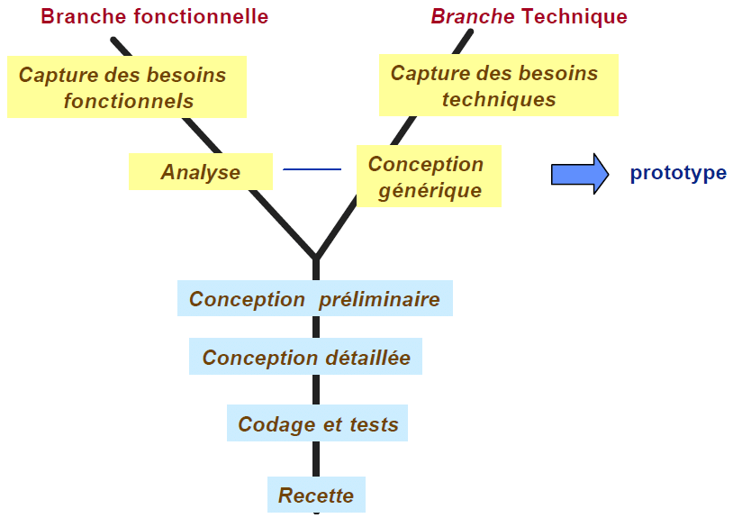

# 2TUP
<!-- new slide -->

## Introduction

<!-- new slide -->
## Les branches de méthode 2tup

<!-- new slide -->
## Les avantages de méthode 2tup

<!-- new slide -->
## Les inconvénients de méthode 2tup

<!-- new slide -->
## Prototype

<!-- new slide -->
## Test

<!-- new slide -->
## Implement

<!-- new slide -->
## Conclusion
