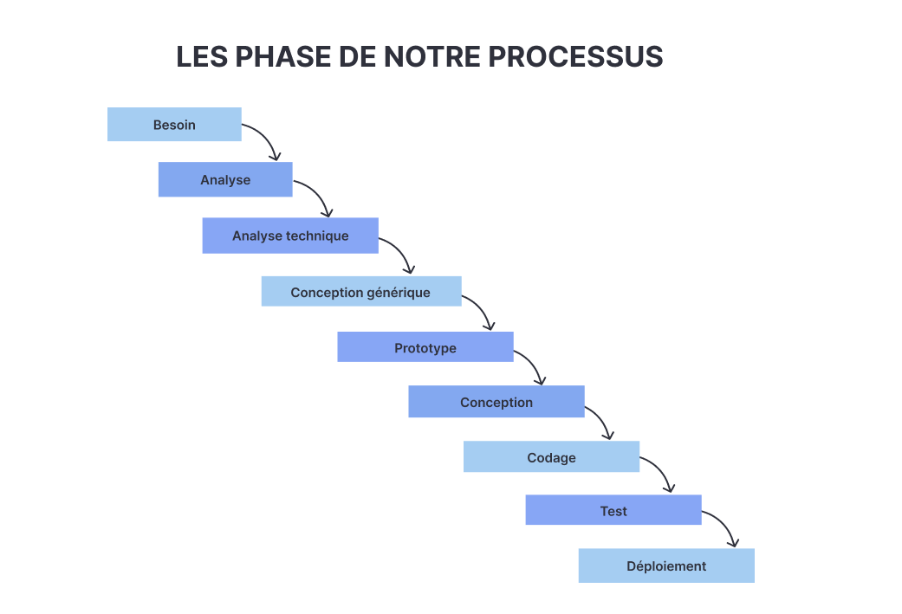

# Présentation

<!-- new slide -->

## Introduction

<!-- new slide -->

## Besoin

<!-- new slide -->

## Analyse 

<!-- new slide -->

## Analyse technique

<!-- new slide -->

## Prototype

<!-- new slide -->

## Conception

<!-- new slide -->

## Codage

<!-- new slide -->

## Test

<!-- new slide -->

## Deploiment

<!-- new slide -->

## Conclusion
