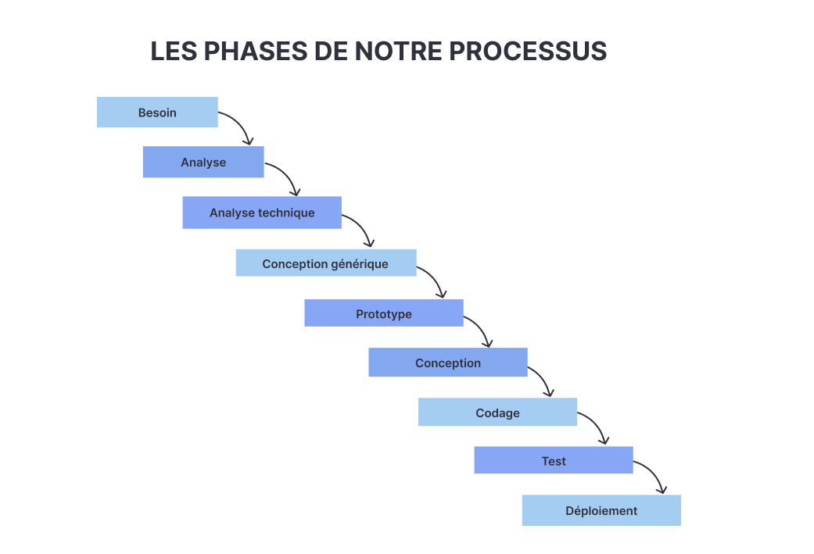

# Notre processus

## Introduction
{:width="500px"}*Les phase de notre processus*

## Besoin
{:width="500px"}*Besoin*

## Analyse 
{:width="500px"}*Analyse*

## Analyse technique
{:width="500px"}*Analyse technique*

## Prototype
{:width="500px"}*Prototype*

## Conception
{:width="500px"}*Conception*

## Codage
{:width="500px"}*Codage*

## Test
{:width="500px"}*Test*

## Deploiment
{:width="500px"}*Deploiment*

## Conclusion