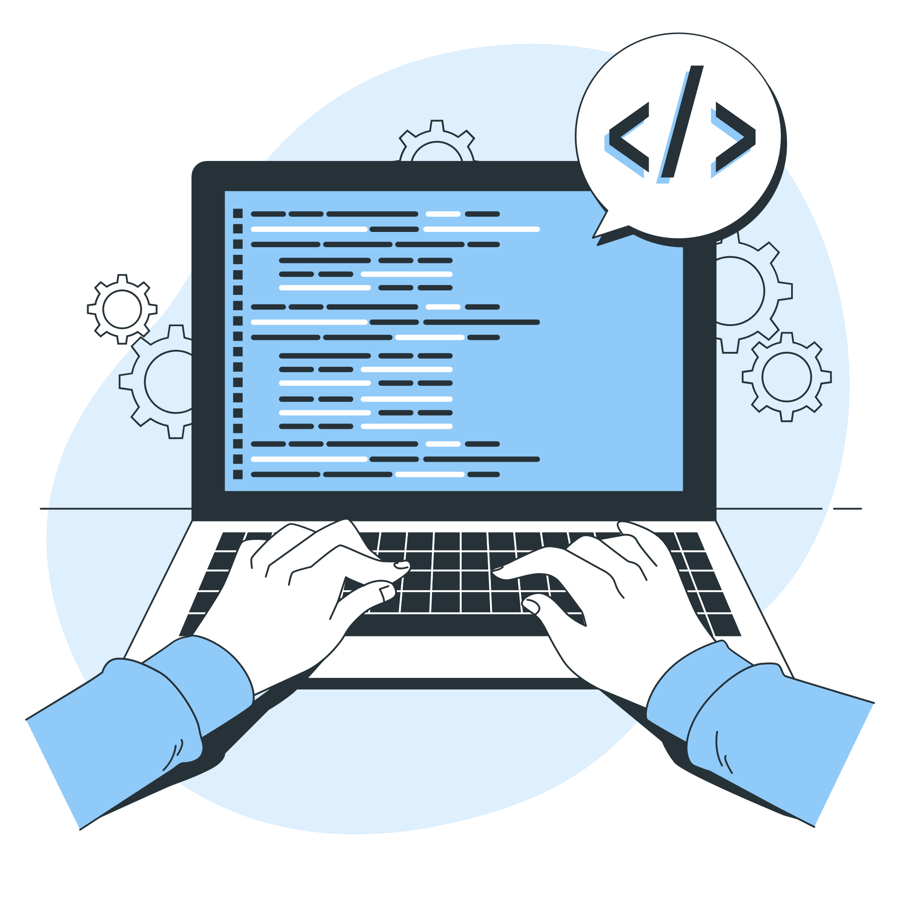

# Les phase de notre processus

# plan 
- [Les phase de notre processus](#les-phase-de-notre-processus)
- [plan](#plan)
  - [Introduction](#introduction)
  - [Besoin](#besoin)
  - [Analyse](#analyse)
  - [Analyse technique](#analyse-technique)
  - [Conception generique](#conception-generique)
  - [Prototype](#prototype)
  - [Conception](#conception)
  - [Codage](#codage)
  - [Test](#test)
  - [Deploiment](#deploiment)
  - [Conclusion](#conclusion)

## Introduction
*figure 1: Les phase de notre processus*

Le processus de développement logiciel est une approche structurée pour créer ou améliorer un système logiciel. 
Ce chapitre est divisé en deux parties : la première partie aborde le 2TUP (Two-Track Unified Process), tandis que la deuxième partie se concentre sur le Design Thinking.

## Besoin

Dans la phase de capture des besoins fonctionnels de la méthode 2TUP, nous utilisons des techniques telles que la carte d'empathie, la définition du problème et l'idéation pour identifier les besoins des utilisateurs finaux. De plus, l'utilisation d'UML, notamment le diagramme de cas d'utilisation, nous aide à clarifier et à structurer ces besoins. 

{:width="300px"}*figure 2: Besoin*

## Analyse 

Au cours de cette phase, nous effectuons une analyse complète des exigences du projet, en tenant compte de divers facteurs tels que la faisabilité, la portée et les défis potentiels. Cet examen approfondi nous permet d'élaborer une stratégie efficace pour les étapes suivantes.

{:width="300px"}*figure 3: Analyse*

## Analyse technique

Ici, nous approfondissons les aspects techniques du projet, en évaluant les technologies, les plates-formes et les cadres qui correspondent le mieux aux exigences définies. Cette étape pose les bases de la mise en œuvre technique de la solution.

{:width="300px"}*figure 4: Analyse technique*

## Conception generique

Au cours de cette phase, nous développons une conception générique ou un plan décrivant la structure globale et les fonctionnalités de la solution. Cela sert de feuille de route pour les étapes de développement ultérieures.

{:width="300px"}*figure 5: conception generique*

## Prototype

En nous appuyant sur la conception générique, nous créons un prototype ou une version initiale de la solution. Ce prototype permet aux parties prenantes de visualiser le concept et de fournir des commentaires pour l'affiner avant de poursuivre.

{:width="300px"}*figure 6: Prototype*

## Conception

Au cours de cette phase, nous nous concentrons sur les aspects de conception détaillés de la solution, notamment la conception de l'interface utilisateur (UI), la conception de la base de données et l'architecture du système. L’objectif est de garantir que la solution soit intuitive, visuellement attrayante et évolutive.

{:width="300px"}*figure 7: Conception*

## Codage

Ici, notre équipe de développement traduit les spécifications de conception en code réel, en suivant les meilleures pratiques et normes de codage. Cette phase implique l'écriture, le test et le débogage du code pour créer les composants fonctionnels de la solution.

{:width="300px"}*figure 8: Codage*

## Test

Des tests rigoureux sont effectués pour valider la fonctionnalité, les performances et la sécurité de la solution développée. Diverses techniques de test telles que les tests unitaires, les tests d'intégration et les tests d'acceptation des utilisateurs sont utilisées pour identifier et corriger tout problème ou écart.

{:width="300px"}*figure 9: Test*

## Deploiment

Une fois que la solution a subi des tests approfondis et répond aux normes de qualité prédéfinies, elle est déployée dans l’environnement de production. Cela implique le déploiement de l'application, la configuration des serveurs et la garantie d'une transition fluide vers l'exploitation en direct.

{:width="300px"}*figure 10: Deploiment*

## Conclusion